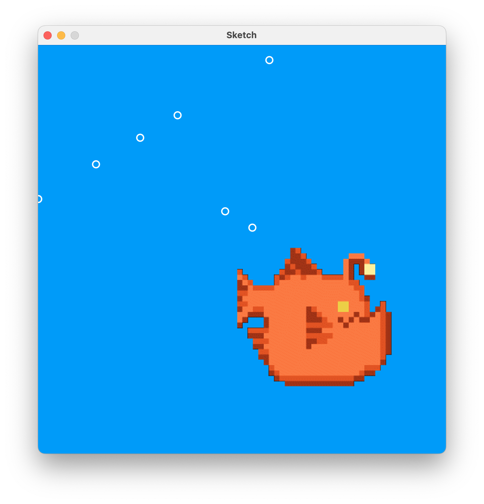

# Interactive Fish & Bubble Sketch (Processing)

## Overview

This project is an interactive Processing sketch written in Java that demonstrates animation, user interaction, and dynamic data structures.

The program displays a fish that swims back and forth across the screen. When the user clicks the mouse, bubbles are generated from the fish’s mouth. These bubbles float upward and are automatically removed once they leave the screen.

This project is provided to you as a demonstration of clear logic, clean structure, and effective use of core programming concepts learned in this class.

## User Interaction

- The fish moves automatically left and right across the screen.
- Mouse click generates a new bubble at the front (mouth) of the fish.
- Bubbles rise upward and disappear once they reach the top of the screen.

There is no keyboard input in the current version of the program.

## Programming Concepts Demonstrated

This project demonstrates effective use of the following ICS3U programming concepts:

- **Variables and data types**  
  - Tracking fish position, speed, and bubble coordinates.
- **Conditional logic**  
  - Reversing fish direction at screen boundaries.
  - Determining bubble spawn position based on fish direction.
- **Repetition (loops)**  
  - Updating and drawing multiple bubbles every frame.
  - Looping backwards to safely remove items from an ArrayList.
- **Methods and decomposition**  
  - Separate methods for movement, drawing, updates, and debugging.
- **Arrays and ArrayLists**  
  - Each bubble is stored as an `int[]` containing `(x, y)`.
  - An `ArrayList<int[]>` is used to manage a dynamic number of bubbles.
- **User input and interactivity**  
  - Mouse clicks create new bubbles during runtime.

## Design Notes

- The program intentionally uses both **arrays** and **ArrayLists** to demonstrate an appropriate use of each.
- Method names are descriptive so that the program structure is easy to understand when reading the code.
- Debugging output is isolated in a dedicated method to avoid cluttering the main logic.
- Boundary checks account for image width to prevent visual clipping.

## Known Limitations / Future Improvements

- Bubble size and speed are fixed.
- Bubbles move only vertically and do not drift sideways.
- Fish movement is limited to a single horizontal path.

## Attribution

**Anglerfish sprite**  
- Artist: @rapidpunches  
- Source: https://opengameart.org/content/anglerfish  
- License: Creative Commons BY-SA

## How to Run

- Open the project in a Java-compatible Processing environment.
- Run `src/Sketch.java`.
- Ensure the `images/` folder is present with all required assets.
